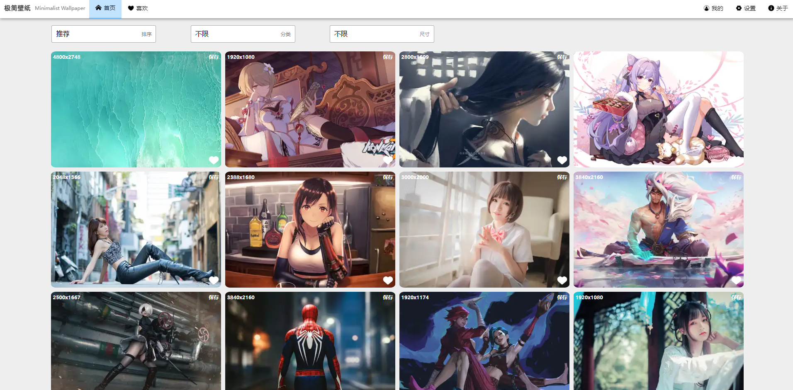
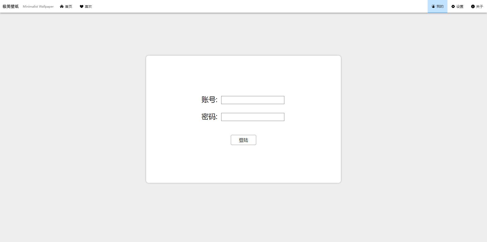
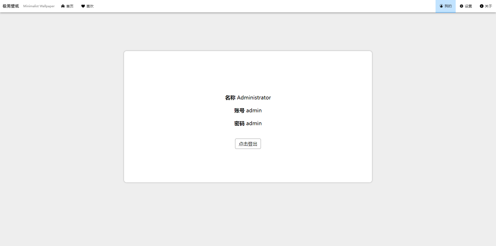
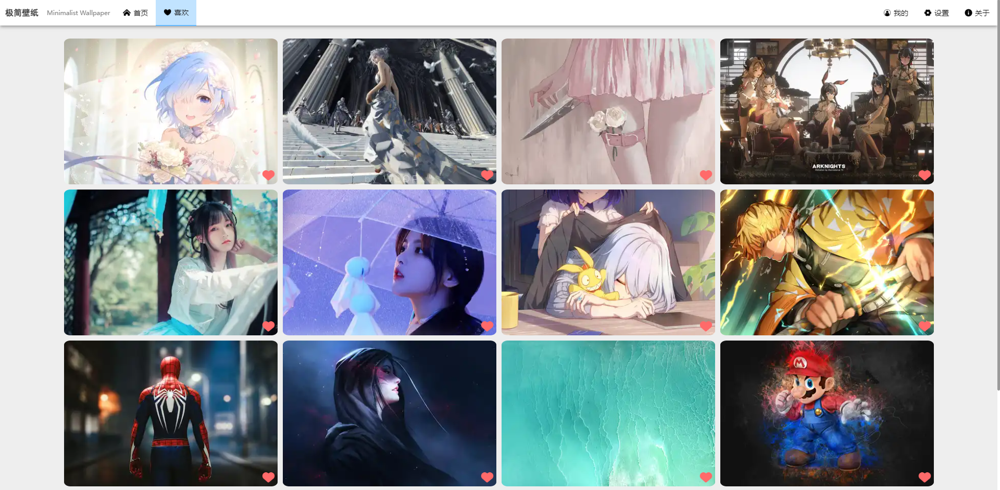
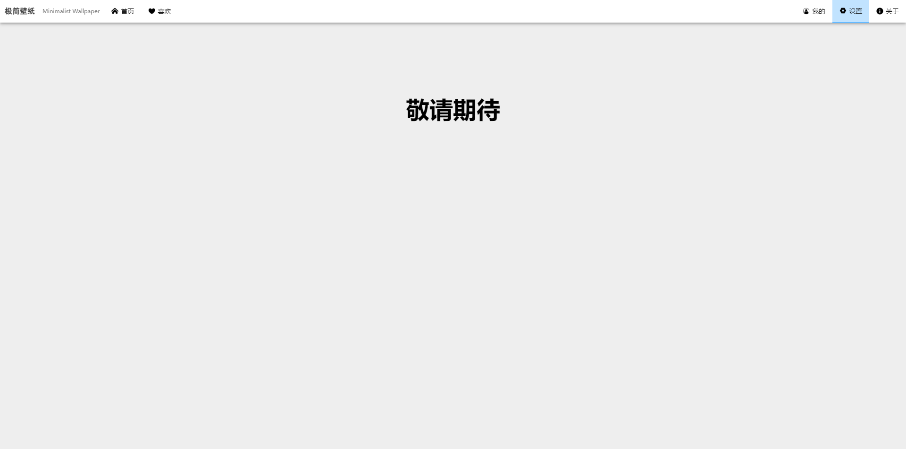
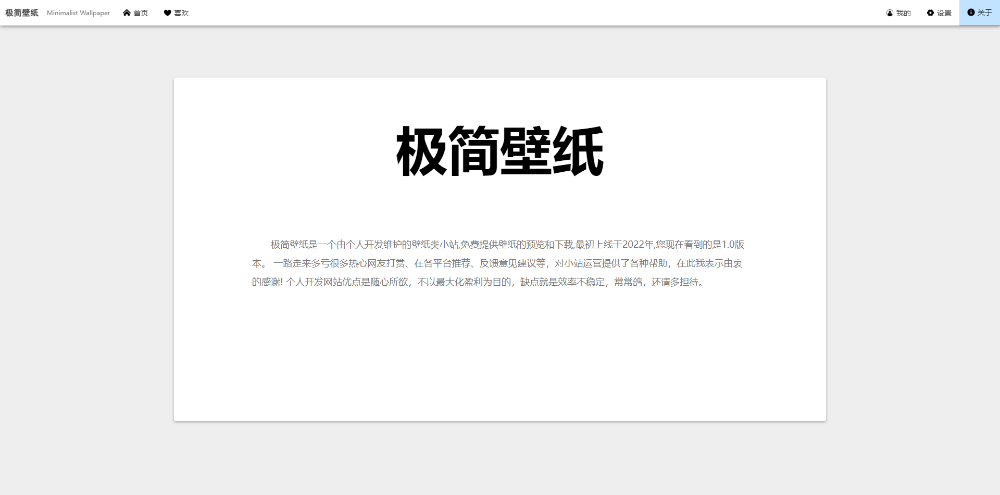

# 极简壁纸仿制应用

> Vue.js+Axios+Nodejs+Mysql的前后端分离的壁纸浏览

## 主要技术构成

> 前端主要技术栈为H5,Css3,Vue.js,Axios;

>后端主要技术栈为Nodejs,Express;

>使用的数据库为Mysql;

## 目录
* [极简壁纸仿制应用](#极简壁纸仿制应用)
* [主要技术构成](#主要技术构成)
* [目录](#目录)
* [应用功能](#应用功能)
    * [前端页面](#前端页面)
    * [后端API](#后端API)
    * [文件目录](#文件目录)
    * [效果展示](#效果展示)
    * [TODO](#TODO)
* [关于配置](#关于配置)
* [License](#License)

## 应用功能
### 前端页面
- index.html           主页
- mine.html            登陆页面
- love.html            用户喜欢的壁纸页
- setting.html         设置页面-暂未编写
- about.html           关于页面
### 后端API
- index.js             发送接收页

### 文件目录
```
├─
│ README.md 
│ .gitignore 
│
├─API
│  ├─index.js               主要Express模块
│  └─routers                部分路由文件夹
│     ├─sql.js               数据库配置
│     ├─getWallpaper.js      获取首页壁纸模块
│     ├─getUser.js           用户登陆模块
│     ├─getUserLove.js       获取用户喜欢的壁纸模块
│     └─setUserLove.js       设置用户喜欢的壁纸模块
│
├─Web
│  ├─index.html             主页
│  ├─css                    主要的css存放目录
│  ├─images                 主要图标存放目录
│  ├─js                     主要的js存放目录
│  │ ├─app                  主要Vue应用文件夹
│  │ ├─lib                  用到的库文件
│  │ ├─config.js            配置API的IP地址
│  │ └─run_fakeLoader.js    主页的加载动画
│  └─page                   主要的子页存放目录
│
└─End
```

### 效果展示
主页



登陆页



喜欢页


设置页


关于页


### TODO
- 简化webpack配置
- 添加BEM代码规范。
- 重构代码
## 关于配置
- 前端页面
  - 在Web/js/config.js 修改ip和port
- 后端接口
  - 在API/routers/sql.js 修改MySQL账号、密码等
  - 在API/index.js 修改port端口
  - 在API下使用CMD,执行npm install即可下载依赖

## License

[Yan_Lin](https://github.com/1730933627/Wallpaper/blob/master/readme.md)